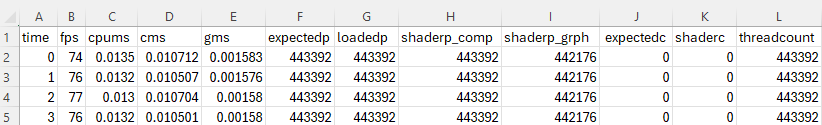

# Fast parallel index-based GPU-driven particle collision detection
## Running verification tests

After the data sets have been generated with genAPP the first process is to verify that 
the program is reading the right number of particles, launching the correct amount of threads,
and counting the exact number of collisions. 

Build and run `FPIBG\vulkan\run\particleOnly/particle*.exe`. It will read the follwing files generated by 
`FPIBG\vulkan\run\GenBenchData\GenDataSets.exe`

`*.bin` -> Contains the binary particle data for particle*.exe

`*.tst` -> Provides confiuration data for each bin file for particle*.exe

After the particle*.exe files have been read and processed it will generate the following files:
	
`*D.csv` -> The performance data generated by particle.exe when run in release mode.

An example of the file is below.

The fields are as follows:

`time` -> in seconds of the test

`fps` -> frames per second

`cpums` -> CPU time to execute

`cms` -> Compute pipline time to execute.

'gms'-> Grapics pipline time to execute.

`expectedp` -> the number of particles from the *.tst file that are expected to be loaded

`loadedp` -> the number of particles loaded by the application before transfer to the GPU

`shaderp_comp` -> the number of particles counted by the compute pipline.

`shaderp_grph` -> the number of particles counted by the graphics pipline.

`expectec` -> the number of collisions expected by the compute pipline.

`shaderc` -> the number of collisions counted by the compute pipline.

`threadcount` -> the number of threads launced by the compute pipline.

The debug mode the program is built as particleD.exe and performs very slow -  
so it no suitable for determining how fast it can run.

The configuration file utilizes libconfig which is C like and very sensitive 
to proper syntax. Information can be found here:

http://hyperrealm.github.io/libconfig/

If there are errors the error will be reported in the log file

`FPIBG\vulkan\run\ParticleOnly\particle.log`

There are a number of program configuration items that can be changed to help debug if required.
The configuration file for particle is located at:

	J:\FPIBG\vulkan\run\particleOnly\Particle.cfg

Open this file in a text editor.

The file is documented but the following config items are important:

The physical device that is used for the test must be set explicitly. 

>1. Run the Vulkan Configurator
>2. In tools menu select  Vulkan Info
>3. Drop down the Presentable Surfaces which will so a list of installed GPU's
>4. Copy the string inside the parenthses. For example the item may be displayed as:
    
	
	GPU id : 0 (NVIDIA RTX 3500 Ada Generation Laptop GPU)
 
Copy the string `NVIDIA RTX 3500 Ada Generation Laptop GPU` to the `phys_device`.

	phys_device		= "NVIDIA RTX 3500 Ada Generation Laptop GPU";

There are four tests that need to be run and are found in the config items below:

	testdirPQB			= "../../../../FPIBGDATA/perfdataPQB"
	testdirCFB			= "../../../../FPIBGDATA/perfdataCFB"
	testdirPCD			= "../../../../FPIBGDATA/perfdataPCD"
	testdirDUP			= "../../../../FPIBGDATA/perfdataDUP"

To select the test to be run set the `perfTest` configuration item to one of the four above. 
For example:

	perfTest		= "testdirPQB";

If the `doAuto' item is set to `true` then the system will iterate through all of the files inthe bench set. 

Each test configuration will run 1 minute per file. If there is some problem that needs to be addressed
you can set the `doAutoWait` 

	doAutoWait		= 0; 

configuration item in second to somthing other than zero. Set to zero it runs the tests for the default one minute.

If you want to run a single test file you can set the `testFile` item to a single file such as

	testfile 		= "../../../../FPIBGDATA/0000CollisionDataSet32X16X3.tst";

and set the `doAuto` config item to `false`

There are a number of config items that can be used - they are documents in the *.cfg file

